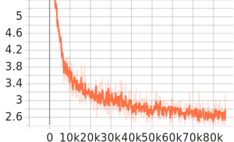
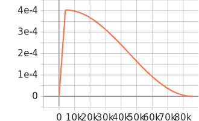
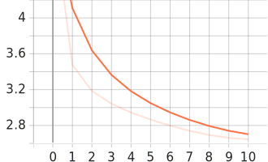
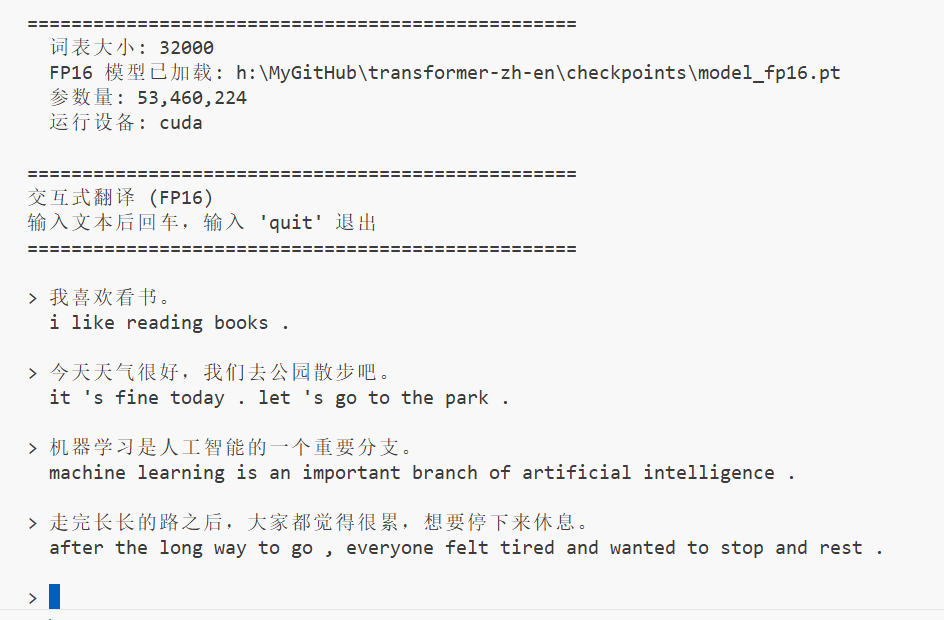

# Transformer 中英机器翻译

纯手写实现 Transformer 论文《Attention Is All You Need》，用于中英机器翻译。
在 4070 Ti 上训练 11 epoch，100 万句对，BLEU 达 36.87。

 **持续更新中， 点个 Star ⭐ 收藏，更新不错过。**

## 项目特性

- **纯手写 Transformer** — 多头注意力、位置编码、掩码机制全部手写，不依赖 `nn.Transformer`
- **统一 BPE 分词** — 中英文共享 32K 词表，SentencePiece 训练（100 万句对）
- **AMP 混合精度** — 自动混合精度训练，4070 Ti 上约 28 it/s
- **余弦退火 + Warmup** — 稳定收敛，11 epoch 达到 BLEU 36.87
- **DDP 多卡支持** — 多卡并行训练
- **完整流水线** — CSV 清洗 → 数据采样 → 分词器训练 → 模型训练 → BLEU 评估

## 环境要求

| 依赖 | 版本（已验证） | 说明 |
|------|---------------|------|
| Python | 3.12 | |
| PyTorch | 2.5.1+cu124 | AMP 混合精度训练 |
| CUDA | 12.4 | GPU 训练 |
| GPU | RTX 4070 Ti (12GB) | 实测约 28 it/s |

```bash
# 推荐使用 conda 环境
conda create -n dl2llm python=3.12
conda activate dl2llm
pip install -r requirements.txt
```

## 快速开始

### 1. 数据准备

数据从魔搭下载（6.3GB CSV）：

👉 [WMT-Chinese-to-English-Machine-Translation-Training-Corpus](https://www.modelscope.cn/datasets/iic/WMT-Chinese-to-English-Machine-Translation-Training-Corpus/files/)

下载后将 CSV 文件放入 `./data/WMT-CN-to-EN/`，然后分三步处理：

#### 1.1 清洗原始 CSV

```bash
python tools/process_wmt.py \
  --input data/WMT-CN-to-EN/wmt_zh_en_training_corpus.csv \
  --output_dir data/wmt_processed
```

输出：`data/wmt_processed/wmt_zh_en_training_corpus.zh` + `.en`（约 2473 万句对）

#### 1.2 采样训练集和测试集

从全量数据中随机采样 100 万训练句对 + 10 万测试句对：

```bash
python -c "
from preprocess_pipeline import step2_sample_data
step2_sample_data('data/wmt_processed/wmt_zh_en_training_corpus.zh',
                  'data/wmt_processed/wmt_zh_en_training_corpus.en',
                  train_num=1000000, valid_num=100000)
"
```

输出：`data/wmt_processed/train.zh`/`.en`（100 万）+ `data/wmt_processed/valid.zh`/`.en`（10 万）

#### 1.3 训练 BPE 分词器

在 100 万训练集上训练中英文统一 BPE 分词器（32K 词表）：

```bash
python -c "
from preprocess_pipeline import step3_train_tokenizer
step3_train_tokenizer('data/wmt_processed/train.zh',
                      'data/wmt_processed/train.en',
                      vocab_size=32000, output_dir='./checkpoints')
"
```

输出：`checkpoints/bpe_unified.model` + `.vocab`

也可一键执行上述三步：

```bash
python preprocess_pipeline.py
```

### 2. 训练

模型自动加载 `checkpoints/bpe_unified.model`（如不存在则自动训练）。

```bash
# 推荐配置：4 层轻量模型，~3 小时获得可用翻译
python train_llm.py \
  --data_dir data/wmt_processed \
  --epochs 11 \
  --batch_size 32 \
  --lr_multiplier 0.5 \
  --checkpoint_dir checkpoints \
  --num_encoder_layers 4 \
  --num_decoder_layers 4 \
  --d_model 384 \
  --d_ff 1536
```

训练过程（4070 Ti 实测）：
- 训练速度：约 28 it/s，单 epoch 约 18 分钟

- 总耗时：11 epoch 约 3 小时

- Loss 收敛：train_loss=2.64，val_loss=2.70

- 最佳模型自动保存至 `checkpoints/best_model.pt`


#### 图1 Train Loss



#### 图2 Train Learning Rate



#### 图3 Val Train Loss(epochs)




多卡训练：

```bash
torchrun --nproc_per_node=3 train_llm.py
```

### 3. 评估

```bash
# 全量评估
python evaluate_bleu.py --checkpoint ./checkpoints/best_model.pt

# 少量样本快速评估
python evaluate_bleu.py --checkpoint ./checkpoints/best_model.pt --max_samples 100
```

| BLEU 分数 | 质量说明 |
|-----------|----------|
| 0-10 | 很差，模型未学习 |
| 10-20 | 一般，基础翻译 |
| 20-30 | 可用 |
| 30-40 | 较好，教学级 |
| 40+ | 优秀，商用级 |

### 4. 推理

提供两套推理方案：

- **`infer.py`（FP32）** — 完整精度，支持 Beam Search
- **`infer_quantized.py`（FP16）** — 半精度 GPU 推理，速度更快，体积仅 102MB

```bash
# FP32 推理（支持 Beam Search）
python infer.py --input "这是一个简单的翻译模型。"
python infer.py --beam_size 5

# 交互式推理
python infer.py

# FP16 推理（需先导出，见下一节）
python infer_quantized.py --input "这是一个简单的翻译模型。"
python infer_quantized.py
```

#### 图4 推理结果展示



 

### 5. FP16 量化导出

训练完成后，将 FP32 模型导出为 FP16 半精度，体积缩小 6 倍，推理速度更快。

```bash
python quantize.py
```

导出结果：
- 输入：`checkpoints/best_model.pt`（FP32, 613 MB）
- 输出：`checkpoints/model_fp16.pt`（FP16, 102 MB）
- 自动验证 FP16 与 FP32 输出一致性

FP16 模型推理：
```bash
python infer_quantized.py                     # 交互式
python infer_quantized.py --input "这是一个简单的翻译模型。"   # 单句
```

FP16 模型可复制到 `translation_infer/checkpoints/` 目录单独分发部署。

## 当前最佳结果

| 指标 | 值 | 说明 |
|------|-----|------|
| val_loss | 2.70 | epoch 11 |
| zh→en BLEU | 36.87 | 1000 样本，greedy decode |
| 总训练时间 | ~3 小时 | 11 epoch，4070Ti 单卡 |
| 训练数据 | 100 万句对 | 从 2473 万句对中采样 |
| 参数量 | 53.5M | 4 层 Transformer |

> **早停策略**：train-val gap 在 epoch 11 反转（train < val），此时停止训练可避免过拟合。

### 训练曲线

使用 TensorBoard 查看逐 epoch 的 loss 和 learning rate 曲线：

```bash
tensorboard --logdir checkpoints/runs
# 浏览器打开 http://localhost:6006
```

## 超参数

### 模型结构

| 参数 | 值 | 说明 |
|------|-----|------|
| d_model | 384 | 隐藏层维度（论文原版 512，消费级 GPU 优化） |
| nhead | 8 | 多头注意力头数 |
| num_encoder_layers | 4 | 编码器层数（论文原版 6，小数据防过拟合） |
| num_decoder_layers | 4 | 解码器层数 |
| d_ff | 1536 | 前馈网络维度（4 × d_model） |
| dropout | 0.1 | Dropout 比率 |
| 参数量 | 53.5M | 论文原版 65M |

### 训练配置

| 参数 | 值 | 说明 |
|------|-----|------|
| batch_size | 32 | 单卡批次大小 |
| accumulate_grad | 1 | 梯度累积步数 |
| epochs | 11 | 目标训练轮数 |
| warmup_steps | 4000 | 学习率预热步数 |
| lr_multiplier | 0.5 | 学习率乘数（余弦退火） |
| label_smoothing | 0.1 | 标签平滑 |
| clip_grad | 1.0 | 梯度裁剪阈值 |

### 数据配置

| 参数 | 值 | 说明 |
|------|-----|------|
| vocab_size | 32,000 | 中英文统一 BPE 词表 |
| max_len | 128 | 最大序列长度 |
| 训练数据量 | 100 万句对 | 从 2473 万句对中采样 |
| 训练耗时 | ~3 小时 | 11 epoch，4070Ti 单卡 |

## 项目结构

```
Transformer_zh_en2026/
├── LICENSE                   # MIT 许可证
├── preprocess_pipeline.py    # 数据预处理流水线
├── train_llm.py              # 训练脚本（AMP + CosineLR + AdamW）【推荐使用】
├── train_2017.py             # 论文原版训练脚本（保留参考）
├── evaluate_bleu.py          # BLEU 评估脚本
├── infer.py                  # 推理脚本（Greedy / Beam Search）
├── quantize.py               # FP16 模型导出脚本
├── infer_quantized.py        # FP16 模型推理脚本
├── config.py                 # 配置参数（含显存适配指南）
├── tokenizer.py              # 统一 BPE 分词器
├── dataset.py                # 数据集加载（TranslationDataset + collate_fn）
├── requirements.txt          # Python 依赖
│
├── models/
│   ├── __init__.py
│   └── transformer.py        # 纯手写 Transformer 实现
│
├── tools/
│   ├── train_tokenizer.py    # 训练 SentencePiece BPE 分词器
│   ├── process_wmt.py        # WMT 原始 CSV → 清洗文本
│   ├── process_subset.py     # 子集数据预处理（去中文空格等）
│   ├── tokenize_text.py      # 分词演示与交互工具
│   ├── test_translate.py     # 翻译功能测试
│   └── check_bpe.py          # BPE 模型信息查看
│
├── scripts/
│   ├── generate_samples.py   # 贪心解码生成
│   ├── generate_beam.py      # Beam Search 生成
│   ├── generate_sampling.py  # 采样生成（temperature / top-k）
│   ├── diagnose_dynamics.py  # 训练动态诊断（lr、loss、grad）
│   ├── analyze_predictions.py# 预测结果分析
│   ├── train_tokenizer_run.py# 分词器训练入口
│   └── ...
│
├── checkpoints/
│   ├── best_model.pt         # 最佳模型检查点（FP32，训练后生成）
│   ├── model_fp16.pt         # FP16 半精度模型（训练后生成）
│   ├── bpe_unified.model     # BPE 分词器模型
│   └── bpe_unified.vocab     # BPE 词表
│
├── translation_infer/        # 独立推理包（可直接发给他人使用）
│   ├── README_INFER.md
│   ├── infer_quantized.py
│   ├── models/
│   │   ├── __init__.py
│   │   └── transformer.py
│   └── checkpoints/
│       ├── model_fp16.pt         # FP16 半精度模型（需从根目录复制）
│       ├── bpe_unified.model
│       ├── bpe_unified.vocab
│       └── tokenizer.py
│
├── data/
│   ├── wmt_processed/        # 处理后的训练数据（需下载，不入仓库）
│   └── debug_small/          # 小规模调试数据（2000 条训练 + 200 条验证）
│
├── README.md
```

## 显存适配

| GPU | 显存 | batch_size | max_len |
|-----|------|------------|---------|
| RTX 4070Ti | 12GB | 64 | 128 |
| RTX 4090 | 24GB | 64 | 200 |
|            |      |            |         |

## 核心实现

### 1. 模型结构（transformer.py）

| 组件 | 实现要点 |
|------|---------|
| PositionalEncoding | 固定正弦/余弦位置编码，`PE(pos,2i)=sin(pos/10000^(2i/d))`，序列超长时动态扩展 |
| Scaled Dot-Product Attention | `softmax(QK^T / √d_k)V`，`-inf` 掩码，NaN 兜底 |
| MultiHeadAttention | 8 头并行，独立 Q/K/V/O 线性投影，`d_k = d_model / nhead` |
| PositionWiseFFN | `Linear → ReLU → Dropout → Linear` |
| AddNorm | Post-LN（残差连接后 LayerNorm，与原论文一致） |
| EncoderLayer | Self-Attn → AddNorm → FFN → AddNorm |
| DecoderLayer | Masked Self-Attn → Cross-Attn → FFN，三层 AddNorm |
| Transformer | 独立 src/tgt embed，Xavier 初始化，`encode/decode/forward` 三入口 |

### 2. 分词器（tokenizer.py）

- 中英文共享 32K BPE 词表（SentencePiece）
- 语言标记 `▁zh`/`▁en` 让 BPE 学习语言特定的子词分布
- 中文去空格直编，英文小写 + 标点分离后编码
- 解码自动判断中文去掉额外空格

### 3. 训练方案

| 方案 | 精度 | 优化器 | LR 调度 | 适用场景 |
|------|------|--------|---------|---------|
| `train_llm.py`（推荐） | AMP 混合精度 | AdamW（wd=0.01） | CosineAnnealing + Warmup | 消费级 GPU 优化 |
| `train_2017.py`（参考） | FP32 | Adam | `d^-0.5 · min(step^-0.5, step · warmup^-1.5)` | 论文复现 |

### 4. 推理与解码

| 策略 | 文件 | 算法要点 |
|------|------|---------|
| Greedy | `infer.py` / `infer_quantized.py` | 每步 `argmax`，到 `eos` 停止 |
| Beam Search | `infer.py` / `scripts/generate_beam.py` | 宽度 5 + length penalty α=0.6 + n-gram 去重 |
| Sampling | `scripts/generate_sampling.py` | Temperature / top-k / n-gram 回退到 argmax |

### 5. 量化导出（quantize.py）

- FP32（613 MB）→ FP16（102 MB），精度无损验证
- 自描述导出格式：`{'model_state_dict': ..., 'model_config': {...}}`
- 导出后可用 `infer_quantized.py` 独立推理，无需 `best_model.pt`

### 6. 数据流水线

```
CSV(6.3GB) → process_wmt.py → 2473万句对
  → sample → 100万 train + 10万 valid
    → train_tokenizer → 32K BPE 词表
```

## 参考

- Attention Is All You Need (Vaswani et al., 2017) — https://arxiv.org/abs/1706.03762

---

## 许可证

本项目采用 MIT 许可证（详见项目根目录 LICENSE 文件）

---

## 使用说明

本项目以 MIT 协议开源：

- 可自由使用、修改、分发，包括商用
- 如用于商业培训课程，请注明出处
- 欢迎 Star / Fork / PR
